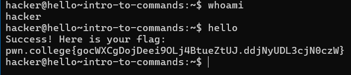
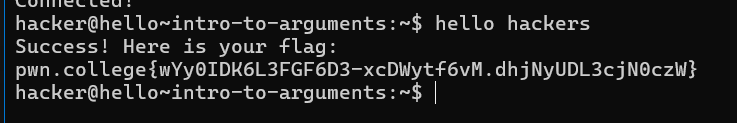

# Challenge Summary: Invoking the `hello` Command

1. **Objective**: Run the `hello` command in the Linux shell to retrieve the flag. 
   - Commands are case-sensitive (`hello` ≠ `HELLO`).

2. **Steps**:
   - Type `hello` after the prompt and hit enter:
     ```bash
     hacker@dojo:~$ hello
     FLAG{1234-5678-HELLO}
     hacker@dojo:~$
     ```
3. **Important**: Make sure the command is in lowercase to avoid errors.
------


# Challenge Summary: Invoking `hello` with an Argument

1. **Objective**: Run the `hello` command with the argument `hackers` to retrieve the flag.
   - The command format is: `hello <argument>`

2. **Steps**:
   - Type `hello hackers` and hit enter:
     ```bash
     hacker@dojo:~$ hello hackers
     FLAG{1234-5678-HELLO-HACKERS}
     hacker@dojo:~$
     ```

3. **Explanation**: `hello` is the command, and `hackers` is the argument.
----

