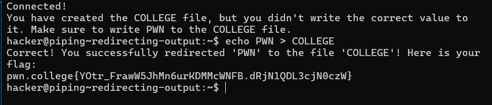
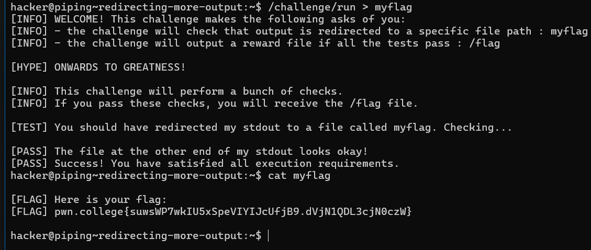
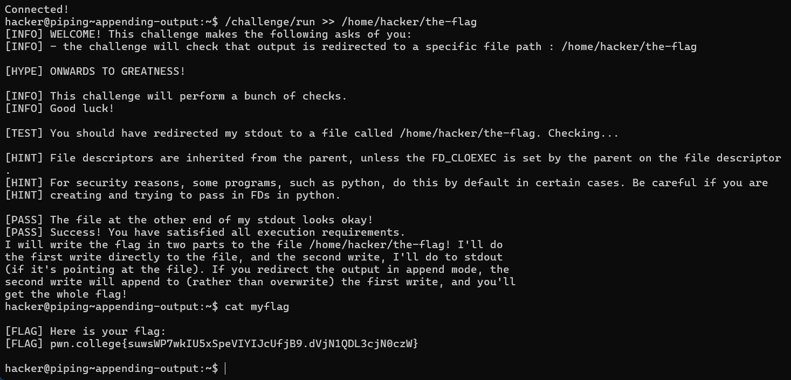
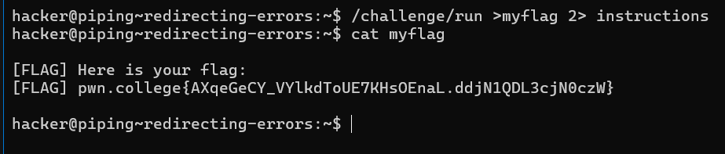
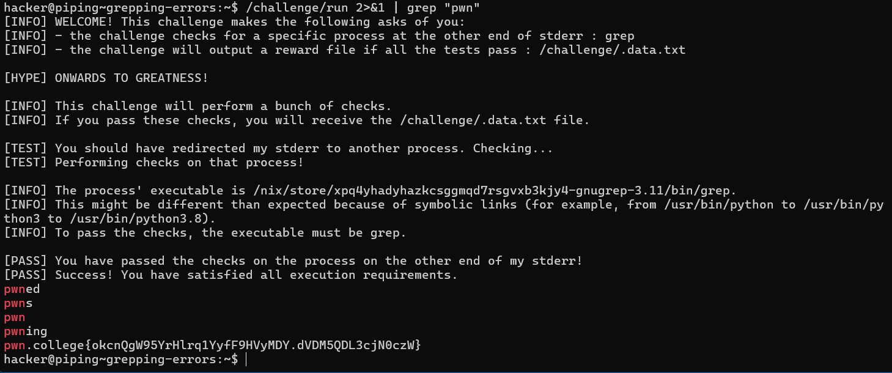
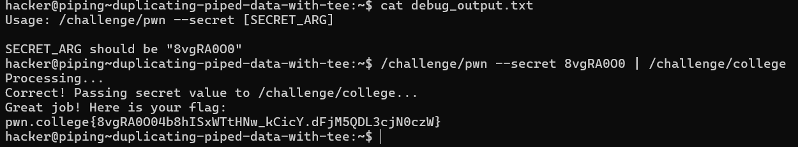

# Redirecting Output

First, let's look at redirecting stdout to files using the `>` character. This allows you to send the output of a command directly into a file.

### Example:

1. **Basic Redirection**:
   ```bash
   hacker@dojo:~$ echo hi > asdf
   hacker@dojo:~$ cat asdf
   hi


# Redirecting More Output

In addition to redirecting the output of `echo`, you can redirect the output of any command. 

### Example:

- The command `/challenge/run` will provide a flag, but you must redirect its output to the file `myflag`. The flag will then be saved in this file!

### Note:
- Even when you redirect stdout, `/challenge/run` will still print to your terminal because it communicates its instructions and feedback over standard error (stderr). It prints the flag over standard output (stdout).

### Challenge:
- Run the following command to capture the flag:
```bash
/challenge/run > myflag
```

# Appending Output

A common use case for output redirection is to save command results for later analysis. Often, you want to run multiple commands and save their output in aggregate. Using `>` will create a new output file each time, overwriting any old contents.

### Appending Output:

To append output to the same file instead of overwriting it, use `>>` instead of `>`. 

### Example:

1. **Append Mode**:
   ```bash
   hacker@dojo:~$ echo pwn > outfile
   hacker@dojo:~$ echo college >> outfile
   hacker@dojo:~$ cat outfile
   pwn
   college
   ```
   
# Redirecting Errors

Just like standard output, you can also redirect the error channel of commands. In Linux, a File Descriptor (FD) is a number that describes a communication channel. Here are the commonly used FDs:

- **FD 0**: Standard Input
- **FD 1**: Standard Output
- **FD 2**: Standard Error

### Redirecting Output:

When you redirect output, you can do so by FD number. A `>` without a number implies `1>`, which redirects FD 1 (Standard Output). 

### Equivalent Commands:
```bash
hacker@dojo:~$ echo hi > asdf
hacker@dojo:~$ echo hi 1> asdf
```


# Redirecting Input

Just like you can redirect output from programs, you can also redirect input to programs using the `<` symbol.

### Example:

1. **Basic Input Redirection**:
   ```bash
   hacker@dojo:~$ echo yo > message
   hacker@dojo:~$ cat message
   yo
   hacker@dojo:~$ rev < message
   oy
   ```
   
# Grepping Errors

### Problem:
- You need to search through errors (stderr) directly using `grep`, but the `|` operator only redirects standard output (stdout), not standard error (stderr).
- There is no `2|` operator to pipe stderr, and `2>` only redirects stderr to a file.

### Solution:
- Use the `>&` operator, which allows redirecting one file descriptor to another.
- Redirect stderr (file descriptor 2) to stdout (file descriptor 1), and then pipe the combined output into `grep` as usual.

### Steps:
1. **Redirect stderr to stdout**:  
   `2>&1`
   
   This merges the error output (stderr) with the normal output (stdout).

2. **Pipe the combined output** to `grep`:  
   `| grep "your_pattern"`

# Duplicating Piped Data with Tee

### Problem:
- When you pipe data from one command to another, it no longer appears on your screen. This can make debugging difficult when you want to see what's happening between commands.

### Solution:
- Use the `tee` command to duplicate the data passing through pipes. It acts like a "T-splitter" in plumbing, allowing you to send data both to the terminal (stdout) and to files, enabling you to intercept and view the data flow while still passing it to the next command.

### Steps:
1. Pipe your command output through `tee`, and specify a file (or multiple files) to save a copy:
   ```bash
   command_1 | tee file_1 | command_2

# Writing for Multiple Programs

### Problem:
- While you can use `tee` to duplicate output to files and standard output, you may want to send output to multiple commands. The `tee` command is designed to write to standard output and files, but you can leverage the shell's ability to treat everything as a file.

### Solution:
- Use **Process Substitution** to duplicate output to multiple commands. This allows you to connect the output of one command to the input of multiple others, enabling you to pipe data effectively.

### Steps:
1. **Use Process Substitution**: 
   - Write an argument in the form `>(command)`, which creates a named pipe connected to the standard input of `command`.
   
2. **Combine with `tee`**: 
   - Use `tee` to send output to standard output while also sending it to the named pipes created for other commands.


# Split Piping Stderr and Stdout

### Problem:
- You need to redirect standard output (stdout) to one program and standard error (stderr) to another. The challenge lies in keeping these outputs separate while still piping them to their respective commands.

### Solution:
- Use a combination of Process Substitution, file redirection, and piping to achieve the desired outcome without mixing stdout and stderr.

### Steps:
1. **Redirect stdout** from the source command to one program.
2. **Redirect stderr** to another program using a named pipe created through Process Substitution.
3. Ensure both outputs are handled independently, allowing you to capture the respective outputs without interference.

### Example Commands:
- You will run the command producing both stdout and stderr, using `>(command)` for stderr and standard piping for stdout.

This method effectively allows you to split the outputs from a single command into two distinct streams, directing them to their appropriate destinations for further processing or debugging.
