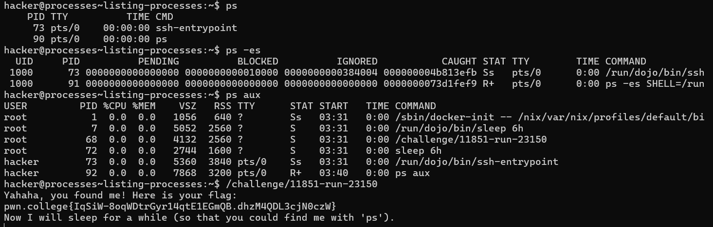
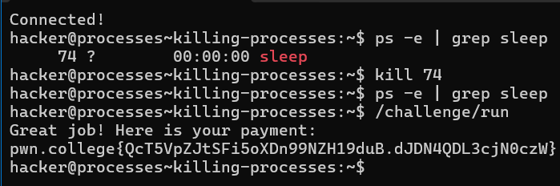
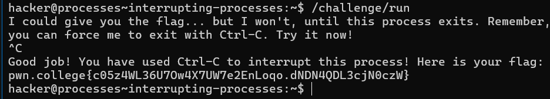
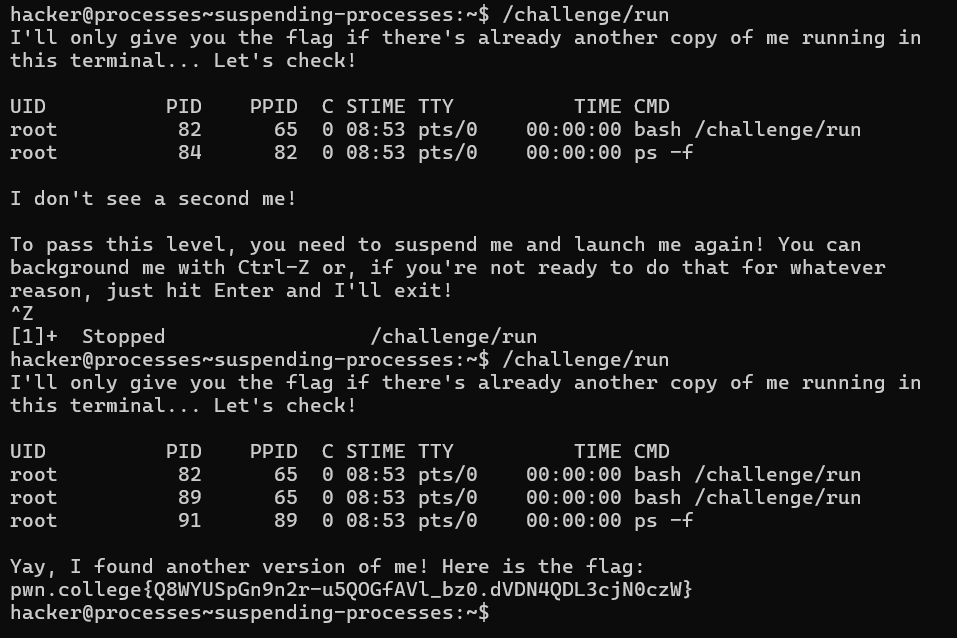
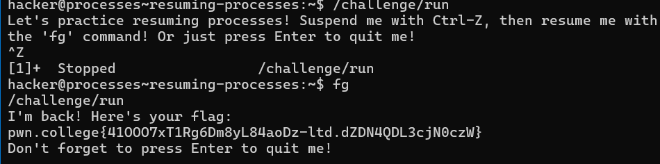
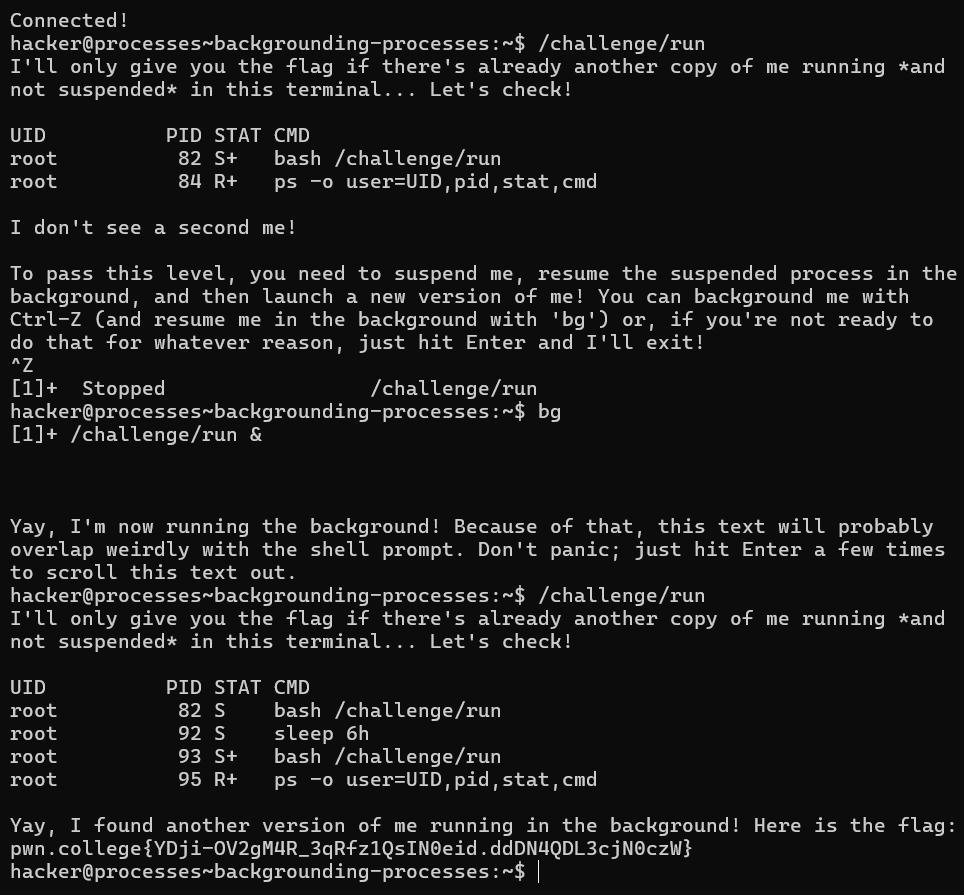
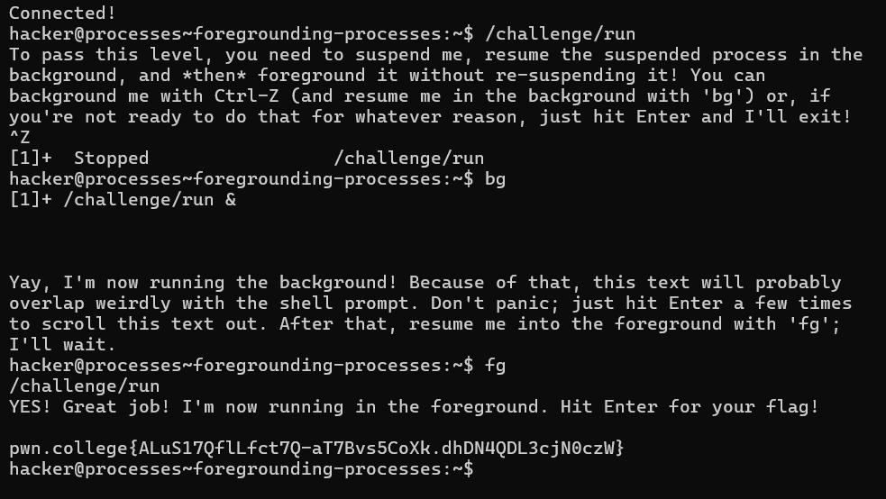
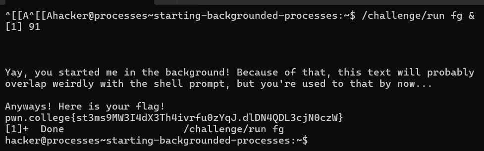
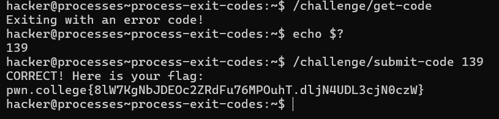

# Listing Processes

In this challenge, you need to identify and relaunch a hidden file that is running as a process but cannot be listed using `ls`.
  - `ps -ef`: Lists all running processes in a detailed format, including parent process ID (PPID) and command arguments.
  - `ps aux`: Provides a more user-readable output, showing CPU and memory usage.

**In this level, i first used ps -ef and ps aux to check what processes are running. my goal was to look for any processes having the name challenge in their paths. then i ran that process and voila! got the flag!**

# Killing Processes

In this challenge, you need to terminate a specific process to proceed.

#### Key Points:
- **Goal**: The `/challenge/run` file will not execute as long as the `/challenge/dont_run` process is active. Your task is to find and kill the `dont_run` process.
- **Steps**:
  1. Use `ps` to find the PID of the `dont_run` process (e.g., `ps -e | grep dont_run`).
  2. Use the `kill` command to terminate it (e.g., `kill [PID]`).

Once the process is killed, you can relaunch `/challenge/run` for the next step.

# Interrupting Processes

- **Objective**: Get the flag by interrupting the process.
- Run `/challenge/run`.
- The program will wait for input or continue running.
- **Press `Ctrl-C`** to send the interrupt signal.
- This sends a `SIGINT` to the process, causing it to terminate.
- After the process stops, you'll receive the flag.

# Suspending Processes

- **Objective**: Suspend a process and run a second copy.
- Run `/challenge/run` in the terminal.
- **Press `Ctrl-Z`** to suspend the running process (this sends the process to the background).
- After suspending, the terminal will be available again.
- Now, **launch another instance** of `/challenge/run` in the same terminal.
- The first process remains suspended in the background while the second runs.

# Resuming Processes

- **Objective**: Suspend and resume a process.
- Run `/challenge/run` in the terminal.
- **Press `Ctrl-Z`** to suspend the process.
- The terminal will be free again with the process in the background.
- **Use the `fg` command** to bring the suspended process back to the foreground.
- The process will resume running in the terminal.

# Background Processes

- **Objective**: Suspend and resume a process in the background, then run another copy.
- Run `/challenge/run` in the terminal.
- **Press `Ctrl-Z`** to suspend the process.
- **Use the `bg` command** to resume the process in the background (this frees up the terminal for other commands).
- Run another instance of `/challenge/run` while the first is still running in the background.
- Check the process status using `ps -o user,pid,stat,cmd` to see the differences:
  - `T` in the `STAT` column: Suspended.
  - `S`: Sleeping in the background.
  - `R+`: Running in the foreground.

# Foreground Processes

- **Objective**: Bring a backgrounded process to the foreground.
- Run `/challenge/run` and **background it** using `Ctrl-Z` followed by the `bg` command.
- To bring the backgrounded process to the foreground, **use the `fg` command**.
- The process will resume in the foreground, allowing you to interact with it directly.

# Starting Background Processes

- **Objective**: Start a process directly in the background.
- To launch `/challenge/run` in the background, run the command like this:
  - `/challenge/run &`
- The process will immediately start running in the background, allowing you to continue using the terminal.
- You can check the process status using `ps -o user,pid,stat,cmd` to confirm it’s running.

# Process Exit Codes

- **Objective**: Retrieve the exit code from one command and use it in another.
- Run `/challenge/get-code` to execute the command.
- **Check the exit code** by running `echo $?` right after the command finishes.
- Use the exit code you retrieved as an argument for the next command:
  - `/challenge/submit-code <exit_code>`
  - Replace `<exit_code>` with the actual code you retrieved.

