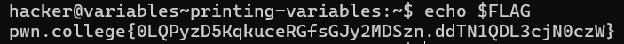
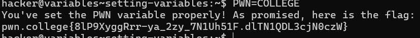
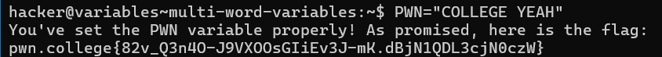
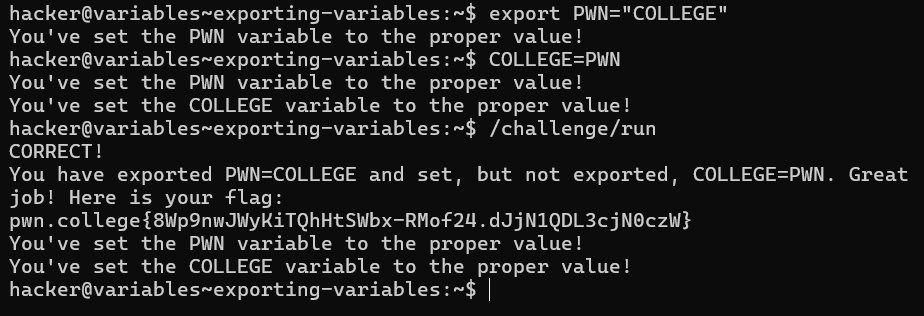
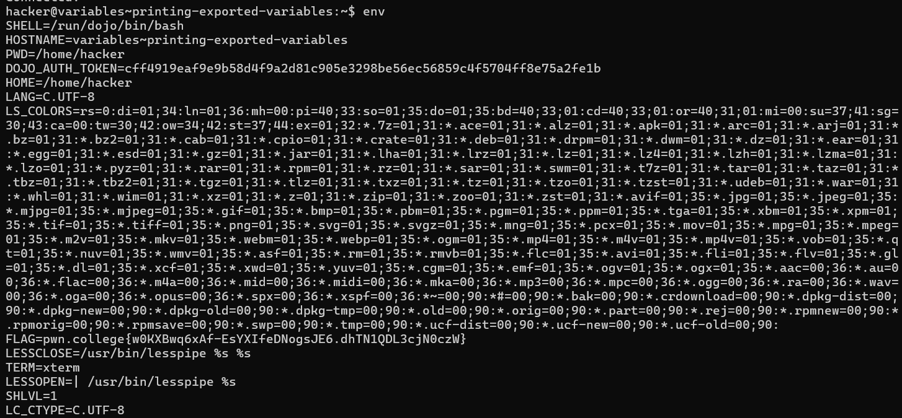
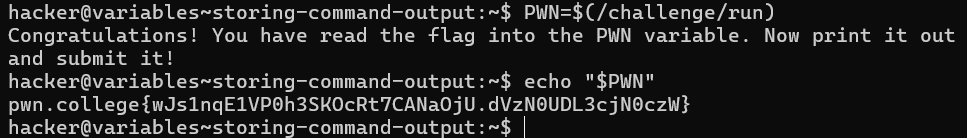
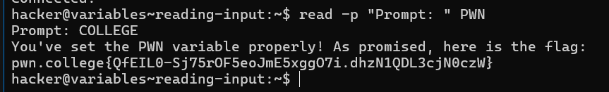
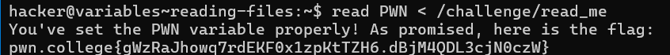

# Printing Variables

### Problem:
- The `/challenge/run` program does not provide the flag directly. Instead, the flag is stored in a variable called `FLAG`, and your task is to print it out using your shell.

### Solution:
- Use the `echo` command to print the value of the `FLAG` variable.

### Steps:
1. **Use the `echo` Command**: 
   - The `echo` command outputs text or variable values to the terminal.
   
2. **Print the Variable**: 
   - To print the value of the `FLAG` variable, prepend the variable name with a dollar sign `$`.


# Setting Variables

### Problem:
- You need to assign a value to a variable in your shell environment. Specifically, set the variable `PWN` to the value `COLLEGE`.
### Steps:
- Assign the value to the variable using the correct syntax. After setting the variable, you can use it in commands as needed.

This challenge emphasizes the importance of proper syntax in variable assignment and the case sensitivity of variable names and values.


# Exporting Variables

### Problem:
- By default, variables set in a shell session are local to that session and are not inherited by child processes. In this challenge, you need to invoke `/challenge/run` with an exported variable `PWN` set to `COLLEGE`, while also setting another variable `COLLEGE` to `PWN` but **not** exporting it.

### Guidelines:
1. **Exporting Variables**:
   - To make a variable available to child processes, use the `export` command.
   - This allows the variable to be passed into the environment of any child processes.

2. **Variable Assignment**:
   - You can combine the assignment and export in one command: `export VAR=value`.

3. **Case Sensitivity**:
   - Remember that variable names are case-sensitive. Ensure you use the correct casing for `PWN` and `COLLEGE`.

### Steps:
1. **Set and Export the Variable**:
   - Assign the value `COLLEGE` to the variable `PWN` and export it.
   
2. **Set the Non-exported Variable**:
   - Assign the value `PWN` to the variable `COLLEGE` without exporting it.

3. **Invoke the Command**:
   - Finally, run the command `/challenge/run` with the variable settings as described.

This challenge emphasizes understanding how shell variables and environment variables interact, particularly the use of `export` to share variable values with child processes.

# Printing Exported Variables

### Problem:
- You need to access and print the value of exported variables in your shell environment, specifically looking for the `FLAG` variable.

### Solution:
- Use the `env` command, which lists all exported environment variables currently set in your shell session.

### Steps:
1. **Run the `env` Command**:
   - Execute the `env` command in your shell to display a list of all exported variables and their values.
   
2. **Locate the `FLAG` Variable**:
   - Review the output to find the `FLAG` variable and its associated value.

This challenge highlights an alternative method to access variables beyond just using `echo`, providing a broader understanding of how to interact with the shell environment.

# Storing Command Output

### Problem:
- You need to capture the output of a command and store it in a variable. Specifically, read the output of the `/challenge/run` command into a variable named `PWN`, which will contain the flag.

### Solution:
- Use **Command Substitution** to achieve this. Command substitution allows you to execute a command and store its output in a variable for later use.

### Steps:
1. **Use Command Substitution**: 
   - Assign the output of the command to a variable using the syntax `VARIABLE=$(command)`.

2. **Example Command**:
   - For this challenge, you would set `PWN` to the output of `/challenge/run` by executing:
     ```bash
     PWN=$(/challenge/run)
     ```

3. **Access the Variable**: 
   - After running the command, you can access the value of `PWN` as needed.

### Note:
- While backticks (`` ` ``) can also be used for command substitution, it is recommended to use the `$(...)` syntax for better readability and ease of nesting commands.

This challenge reinforces the concept of capturing command output and highlights the utility of command substitution in shell scripting.

# Reading Input

### Problem:
- You need to read user input from the terminal and store it in a variable. Specifically, set the variable `PWN` to the value `COLLEGE` using the `read` command.

### Solution:
- Utilize the `read` builtin command to capture input from the user and assign it to the specified variable.

### Steps:
1. **Use the `read` Command**: 
   - You can prompt the user for input and store it in a variable using the syntax: 
   ```bash
   read -p "Prompt: " VARIABLE_NAME

# Reading Files

### Problem:
- You need to read the contents of a file directly into an environment variable without using the `cat` command. Specifically, read the contents of `/challenge/read_me` into the variable `PWN`.

### Solution:
- Use the `read` command in combination with input redirection to achieve this without invoking an extra process.

### Steps:
1. **Use the `read` Command**:
   - Redirect the file to the standard input of the `read` command using the `<` operator.
   
2. **Assign the Value to `PWN`**:
   - The command to read the file into the `PWN` variable will look like this:
   ```bash
   read PWN < /challenge/read_me
