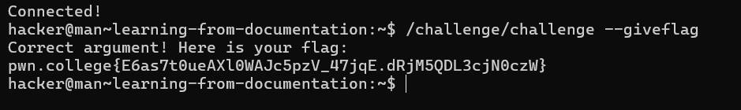
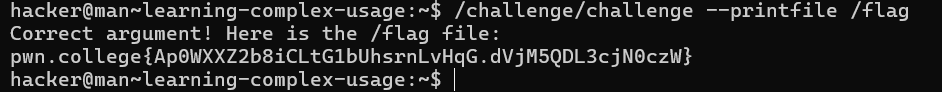
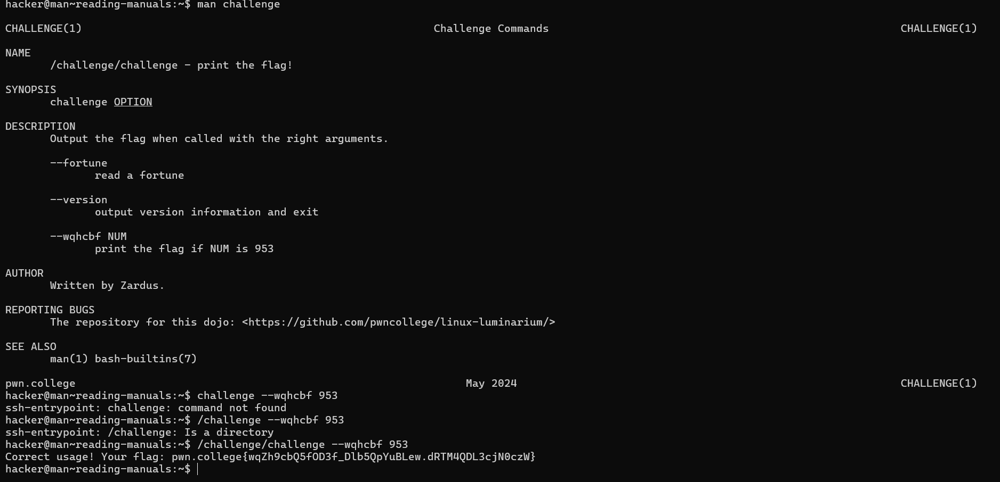
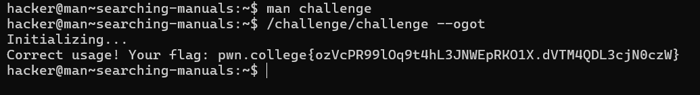
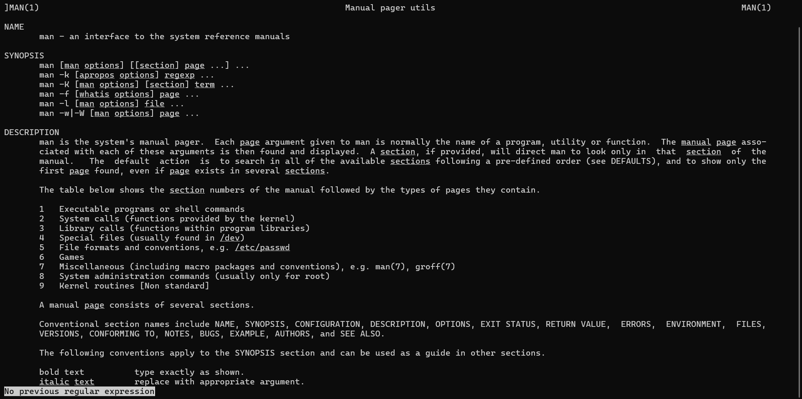
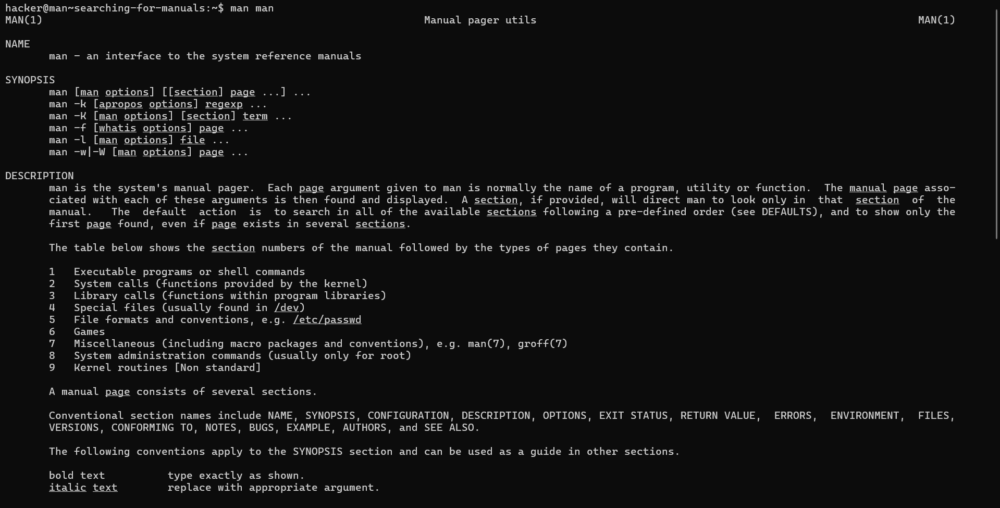
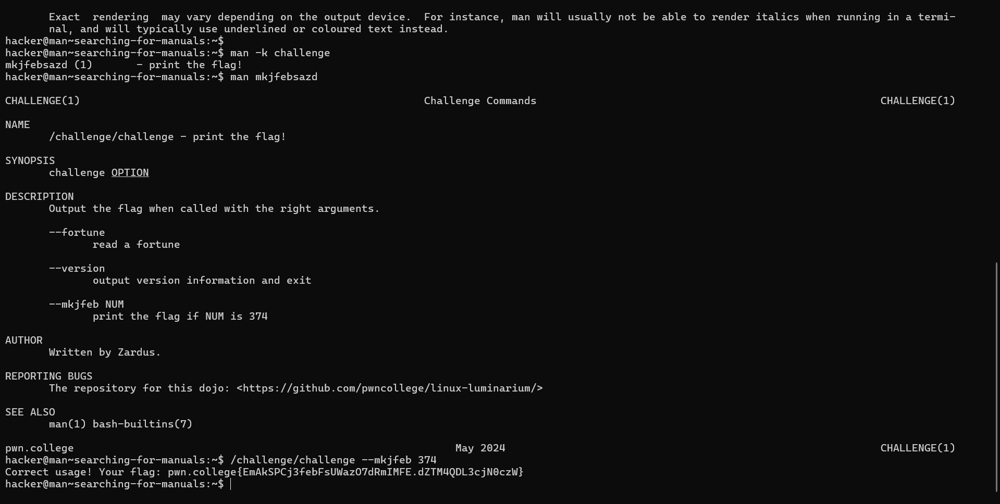
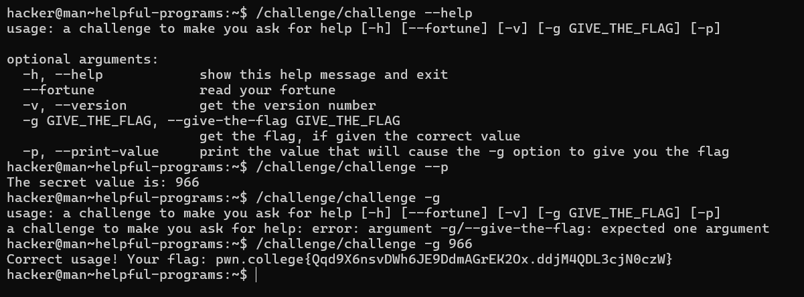
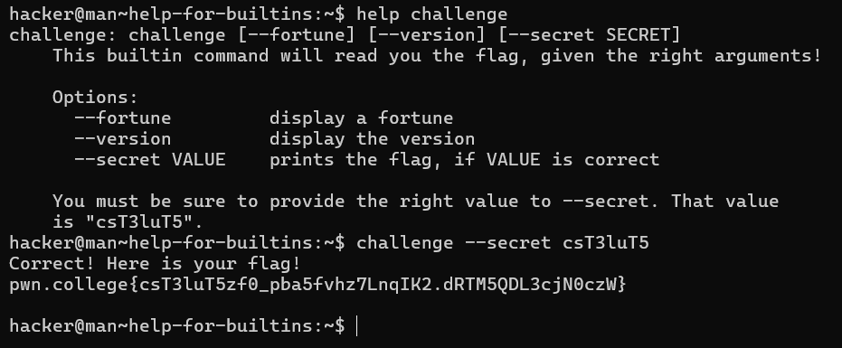

# Challenge: Learning from Documentation

## Objective
Properly invoke the `/challenge/challenge` program by passing the correct argument to retrieve the flag.

## Steps to Complete the Challenge

1. **Run the Command**:
   Use the following command to invoke the program with the required argument:
   ```bash
   /challenge/challenge --giveflag

# Challenge: Learning Complex Usage

## Objective
Invoke the `/challenge/challenge` program correctly to print the flag file by using the appropriate arguments.

## Steps to Complete the Challenge

1. **Run the Command**:
   Use the following command to invoke the program with the required arguments:
   ```bash
   /challenge/challenge --printfile /flag


# Challenge: Reading Manuals

## Objective
Learn about the `/challenge/challenge` program by reading its manual and discovering a secret option that prints the flag.

## Steps to Complete the Challenge

1. **View the Manual Page**:
   Use the following command to open the manual for the challenge program:
   ```bash
   man challenge

# Challenge: Searching Manuals

## Objective
Use the `man` command to search through the manual of the `/challenge/challenge` program and find the specific option that reveals the flag.

## Steps to Complete the Challenge

1. **Open the Manual Page**:
   Execute the following command to view the manual for the challenge program:
   ```bash
   man challenge

# Challenge: Searching for Hidden Manuals

## Objective
Locate the hidden manual page for the `/challenge/challenge` program by searching the manual page database using advanced `man` command techniques. 

## Steps to Complete the Challenge

1. **Learn Advanced man Usage**:
   First, read the manual for the `man` command to learn about searching for specific manual pages.
   ```bash
   man challenge
   



# Challenge: Helpful Programs

## Objective
Learn how to retrieve program documentation using the `--help` argument.

## Steps to Complete the Challenge

1. **Run the Program with `--help`**:
   Many programs display documentation when run with `--help`. Try it with the challenge program to see its usage information.
   ```bash
   /challenge/challenge --help

# Challenge: Help for Builtins

## Objective
Learn how to look up help documentation for shell builtins using the `help` command.

## Steps to Complete the Challenge

1. **Get a List of Builtins**:
   Run the `help` command to see a list of all shell builtins.
   ```bash
   help
