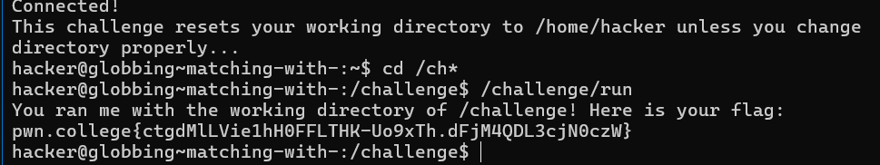
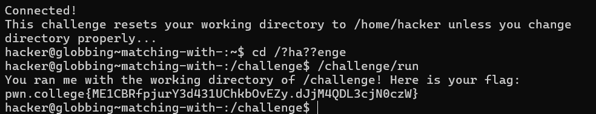
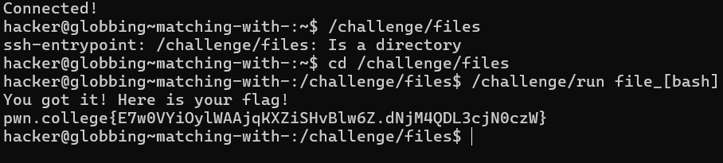
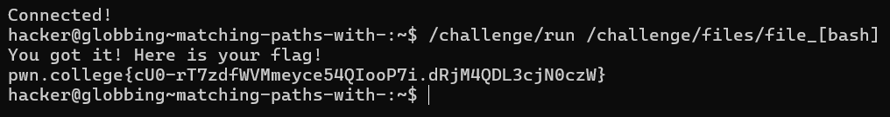
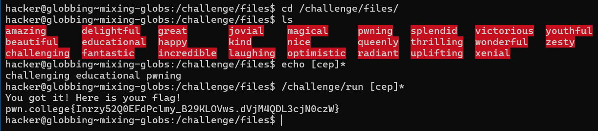
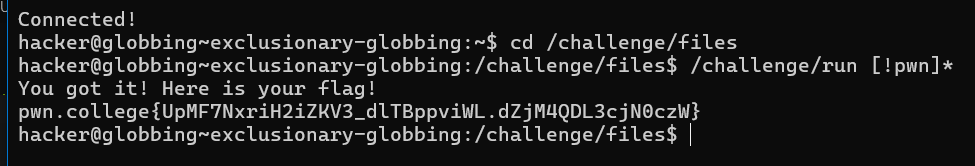

### MATCHING WITH `*`

The `*` wildcard character in the shell is used for pattern matching in filenames. It allows the shell to replace the argument with files that match the pattern.

#### Examples:

1. **Multiple Matches**:
   ```bash
   hacker@dojo:~$ touch file_a
   hacker@dojo:~$ touch file_b
   hacker@dojo:~$ touch file_c
   hacker@dojo:~$ ls
   file_a	file_b	file_c
   hacker@dojo:~$ echo Look: file_*
   Look: file_a file_b file_c
   ```

    
   -----
   
# MATCHING WITH `?`
The `?` wildcard character in the shell is used as a single-character wildcard. It matches exactly one character in a filename.

#### Examples:

1. **MATCHING WITH **:
   ```bash
   hacker@dojo:~$ touch file_a
   hacker@dojo:~$ touch file_b
   hacker@dojo:~$ touch file_cc
   hacker@dojo:~$ ls
   file_a	file_b	file_cc
   hacker@dojo:~$ echo Look: file_?
   Look: file_a file_b


# Matching with `[]`

The `[]` wildcard is a limited form of the `?` wildcard. Instead of matching any character, `[]` allows you to specify a subset of potential characters to match, with each character included in the brackets.

### Examples:

1. **Character Set Match**:
   ```bash
   hacker@dojo:~$ touch file_a
   hacker@dojo:~$ touch file_b
   hacker@dojo:~$ touch file_c
   hacker@dojo:~$ ls
   file_a	file_b	file_c
   hacker@dojo:~$ echo Look: file_[ab]
   Look: file_a file_b


# Matching Paths with `[]`

Globbing happens on a path basis, allowing you to expand entire paths using globbed arguments.

### Example:

1. **Path Expansion**:
   ```bash
   hacker@dojo:~$ touch file_a
   hacker@dojo:~$ touch file_b
   hacker@dojo:~$ touch file_c
   hacker@dojo:~$ ls
   file_a	file_b	file_c
   hacker@dojo:~$ echo Look: /home/hacker/file_[ab]
   Look: /home/hacker/file_a /home/hacker/file_b


# Mixing Globs

Now, let's combine what we've learned about globbing! We have a few diversely-named files in `/challenge/files`.

### Task:
- Navigate to the `/challenge/files` directory.
- Use your knowledge of globbing to write a single, short glob (6 characters or less) that matches the files `challenging`, `educational`, and `pwning`.

### Example Command:
```bash
cd /challenge/files
ls [ce]*g*
```


# Exclusionary Globbing

Sometimes, you want to filter out files in a glob! The `[]` wildcard can help with this. If the first character in the brackets is a `!` or (in newer versions of bash) a `^`, the glob inverts, matching characters that aren't listed.

### Examples:

1. **Inverted Matches**:
   ```bash
   hacker@dojo:~$ touch file_a
   hacker@dojo:~$ touch file_b
   hacker@dojo:~$ touch file_c
   hacker@dojo:~$ ls
   file_a	file_b	file_c
   hacker@dojo:~$ echo Look: file_[!ab]
   Look: file_c

   hacker@dojo:~$ echo Look: file_[^ab]
   Look: file_c

   hacker@dojo:~$ echo Look: file_[ab]
   Look: file_a file_b

