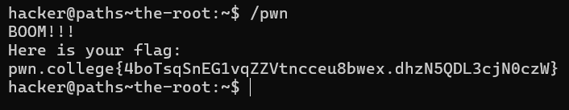
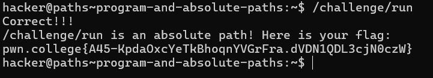
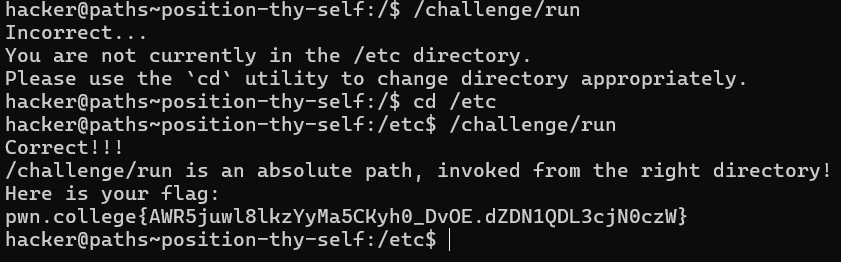
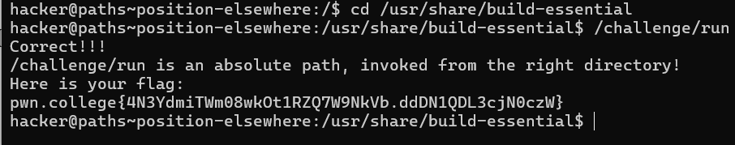
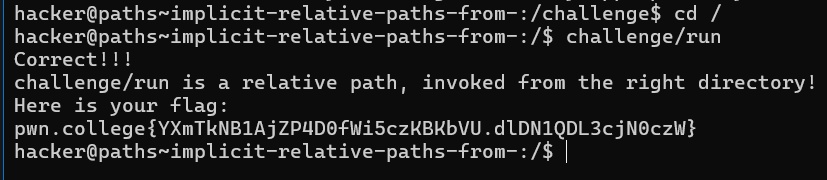
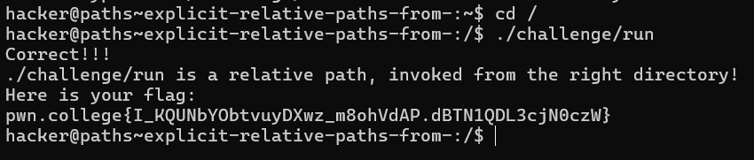
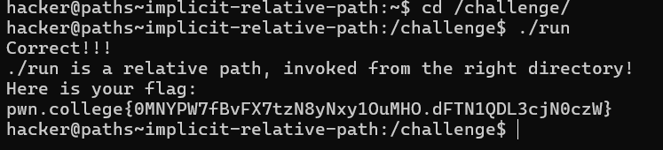
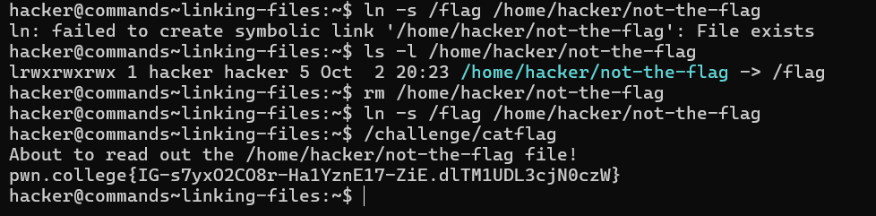

# Challenge Summary: Invoking `pwn` Using an Absolute Path

1. **Objective**: Run the `pwn` program located in the root directory `/` to retrieve the flag.
   - You need to use an **absolute path** to invoke the program.

2. **Steps**:
   - Type the following command and hit enter:
     ```bash
     hacker@dojo:~$ /pwn
     FLAG{1234-5678-PWN}
     hacker@dojo:~$
     ```

3. **Explanation**:
   - The command `/pwn` uses an absolute path starting from the root directory `/` to run the `pwn` program.
------

# Challenge Summary: Invoking `run` from the `/challenge` Directory

1. **Objective**: Execute the `run` program located in the `/challenge` directory using its absolute path to retrieve the flag.

2. **Steps**:
   - Type the following command and hit enter:
     ```bash
     hacker@dojo:~$ /challenge/run
     FLAG{1234-5678-RUN}
     hacker@dojo:~$
     ```

3. **Explanation**:
   - The program `run` is in the `/challenge` directory, and using the absolute path `/challenge/run` will execute the program to display the flag.
   ------

# Challenge Summary: Using `cd` and Running `run` from a Specific Directory

1. **Objective**: Navigate to a specific directory using `cd` and execute the `/challenge/run` program from that location to retrieve the flag.

2. **Steps**:
   - Change to the specified directory:
     ```bash
     hacker@dojo:~$ cd /path/to/specific/directory
     hacker@dojo:/path/to/specific/directory$
     ```
   - Then, run the `run` program from that directory:
     ```bash
     hacker@dojo:/path/to/specific/directory$ /challenge/run
     FLAG{1234-5678-RUN}
     ```

3. **Explanation**:
   - The `cd` command changes the current working directory, allowing you to navigate the filesystem. After reaching the target directory, you can execute the `run` program using its absolute path.
----

# Challenge Summary: Using `cd` and Running `run` from a Specific Directory

1. **Objective**: Navigate to a specific directory using `cd` and execute the `/challenge/run` program from that location to retrieve the flag.

2. **Steps**:
   - Change to the specified directory:
     ```bash
     hacker@dojo:~$ cd /path/to/specific/directory
     hacker@dojo:/path/to/specific/directory$
     ```
   - Then, run the `run` program from that directory:
     ```bash
     hacker@dojo:/path/to/specific/directory$ /challenge/run
     FLAG{1234-5678-RUN}
     ```

3. **Explanation**:
   - The `cd` command changes the current working directory, allowing you to navigate the filesystem. After reaching the target directory, you can execute the `run` program using its absolute path.
----

# Challenge Summary: Using Relative Paths to Run `run`

1. **Objective**: Execute the `/challenge/run` program using a **relative path** while your current working directory (cwd) is `/`.

2. **Steps**:
   - First, ensure you are in the root directory `/`:
     ```bash
     hacker@dojo:~$ cd /
     hacker@dojo:/$
     ```
   - Now, use the relative path to execute the `run` program:
     ```bash
     hacker@dojo:/$ challenge/run
     FLAG{1234-5678-RELATIVE-RUN}
     ```

3. **Explanation**:
   - The relative path `challenge/run` works because the cwd is `/`. Since `/challenge/run` is located directly under the root, you only need to refer to it relatively as `challenge/run` without the `/`.
---


# Challenge Summary: Using Explicit Relative Paths with `.`

1. **Objective**: Execute the `/challenge/run` program using an **explicit relative path** that includes `.` while your current working directory (cwd) is `/`.

2. **Understanding `.`**: 
   - The `.` refers to the current directory. The following paths are equivalent:
     - `/challenge`
     - `./challenge`
     - `././challenge`
     - `challenge`.

3. **Steps**:
   - Make sure you are in the root directory `/`:
     ```bash
     hacker@dojo:~$ cd /
     hacker@dojo:/$
     ```
   - Run the `run` program using the explicit relative path:
     ```bash
     hacker@dojo:/$ ./challenge/run
     FLAG{1234-5678-EXPLICIT}
     ```

4. **Explanation**:
   - The command `./challenge/run` explicitly references the current directory with `.` and correctly points to the program.
-----

# Challenge Summary: Running `run` from the Current Directory Using `.`

1. **Objective**: Execute the `run` program from the `/challenge` directory using an explicit relative path with `.`.

2. **Key Concept**: 
   - Linux does not automatically search the current directory for commands when you enter a "naked" path. For example:
     ```bash
     hacker@dojo:/challenge$ run
     bash: run: command not found
     ```
   - This is a safety feature to prevent accidental execution of programs with the same name.

3. **Steps**:
   - Change to the `/challenge` directory:
     ```bash
     hacker@dojo:~$ cd /challenge
     hacker@dojo:/challenge$
     ```
   - Run the `run` program using the explicit relative path:
     ```bash
     hacker@dojo:/challenge$ ./run
     FLAG{1234-5678-CURRENT-DIR}
     ```

4. **Explanation**:
   - By using `./run`, you explicitly tell Linux to execute the `run` program in the current directory, bypassing the safety check.
   ------

# Challenge Summary: Writing a Flag to a File in Your Home Directory

1. **Objective**: Use the `/challenge/run` program to write a copy of the flag to a specified file in your home directory, adhering to the provided constraints.

2. **Constraints**:
   - The argument must be an **absolute path**.
   - The path must be **inside your home directory** (`/home/hacker`).
   - The specified file name must be **three characters or less** before expansion.

3. **Steps**:
   - Ensure you are in your home directory:
     ```bash
     hacker@dojo:~$ cd ~
     hacker@dojo:~$
     ```
   - Run the `run` program with an absolute path to a file name that is three characters or less, for example:
     ```bash
     hacker@dojo:~$ /challenge/run /home/hacker/flag
     FLAG{1234-5678-FILE}
     ```

4. **Explanation**:
   - The command uses the absolute path `/home/hacker/flag` to specify where the flag should be written. The name `flag` is three characters or l
--------
# Challenge Summary: Linking Files

## Objective
Use symbolic links to access the flag file located at `/flag` via the `/challenge/catflag` program, which reads from `/home/hacker/not-the-flag`.

## Understanding Symbolic Links
- **Symbolic Link (Symlink)**: A reference to another file or directory that points to its location.
- **Command to Create a Symlink**:
  ```bash
  ln -s [original_file_path] [link_path]
