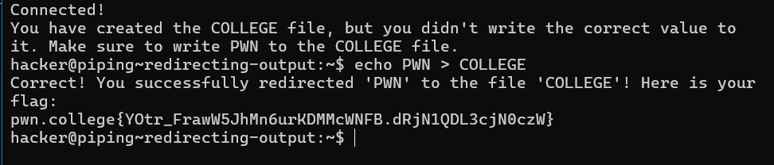
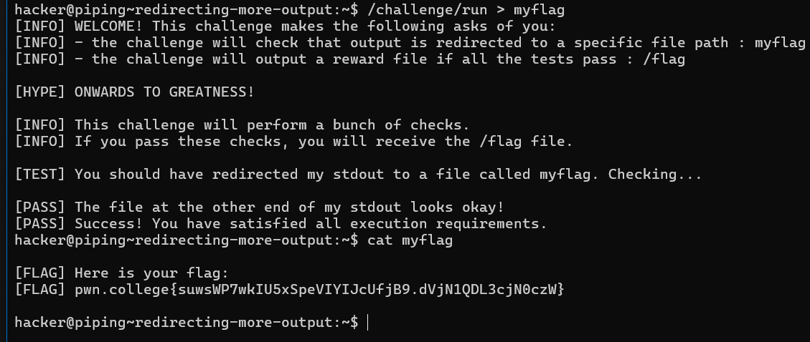
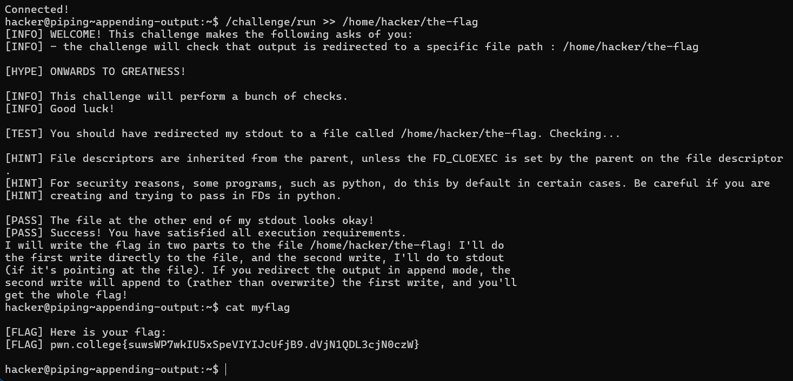
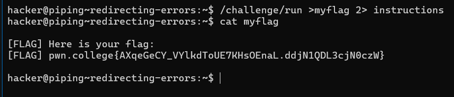
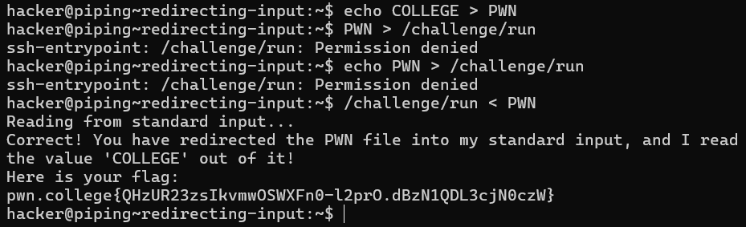

# Redirecting Output

First, let's look at redirecting stdout to files using the `>` character. This allows you to send the output of a command directly into a file.

### Example:

1. **Basic Redirection**:
   ```bash
   hacker@dojo:~$ echo hi > asdf
   hacker@dojo:~$ cat asdf
   hi


# Redirecting More Output

In addition to redirecting the output of `echo`, you can redirect the output of any command. 

### Example:

- The command `/challenge/run` will provide a flag, but you must redirect its output to the file `myflag`. The flag will then be saved in this file!

### Note:
- Even when you redirect stdout, `/challenge/run` will still print to your terminal because it communicates its instructions and feedback over standard error (stderr). It prints the flag over standard output (stdout).

### Challenge:
- Run the following command to capture the flag:
```bash
/challenge/run > myflag
```

# Appending Output

A common use case for output redirection is to save command results for later analysis. Often, you want to run multiple commands and save their output in aggregate. Using `>` will create a new output file each time, overwriting any old contents.

### Appending Output:

To append output to the same file instead of overwriting it, use `>>` instead of `>`. 

### Example:

1. **Append Mode**:
   ```bash
   hacker@dojo:~$ echo pwn > outfile
   hacker@dojo:~$ echo college >> outfile
   hacker@dojo:~$ cat outfile
   pwn
   college
   ```
   
# Redirecting Errors

Just like standard output, you can also redirect the error channel of commands. In Linux, a File Descriptor (FD) is a number that describes a communication channel. Here are the commonly used FDs:

- **FD 0**: Standard Input
- **FD 1**: Standard Output
- **FD 2**: Standard Error

### Redirecting Output:

When you redirect output, you can do so by FD number. A `>` without a number implies `1>`, which redirects FD 1 (Standard Output). 

### Equivalent Commands:
```bash
hacker@dojo:~$ echo hi > asdf
hacker@dojo:~$ echo hi 1> asdf
```


# Redirecting Input

Just like you can redirect output from programs, you can also redirect input to programs using the `<` symbol.

### Example:

1. **Basic Input Redirection**:
   ```bash
   hacker@dojo:~$ echo yo > message
   hacker@dojo:~$ cat message
   yo
   hacker@dojo:~$ rev < message
   oy
   ```
   

