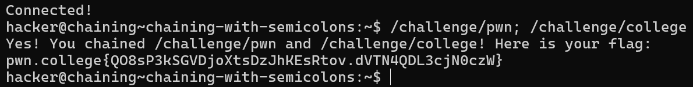
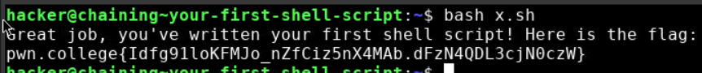
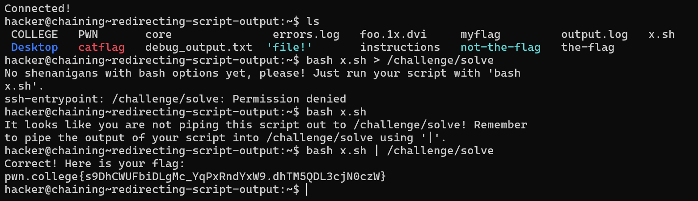
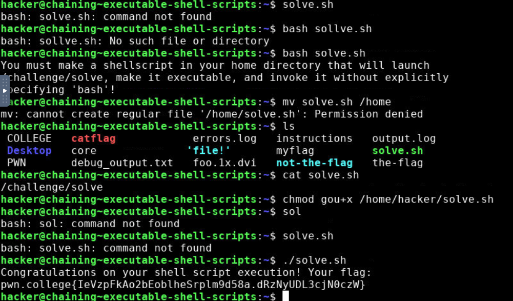

# Chaining Commands with `;`

In this challenge, you will practice chaining commands using the semicolon (`;`). This allows you to run multiple commands in a single line.

#### Key Points:
- **Goal**: Run `/challenge/pwn` and then `/challenge/college`, chaining them together with a semicolon.
- **Steps**:
  1. Enter the following command in your terminal:
     ```bash
     /challenge/pwn; /challenge/college
     ```

Using the semicolon, both commands will execute in order, with the second command starting after the first one completes.

# Your First Shell Script

In this challenge, you will create and execute your first shell script. This allows you to run a series of commands from a file instead of typing them directly in the terminal.

#### Key Points:
- **Goal**: Create a shell script called `x.sh` to run `/challenge/pwn` and then `/challenge/college`.
- **Steps**:
  1. Open a text editor and create a new file named `x.sh`.
  2. Add the following lines to the file:
     ```bash
     /challenge/pwn
     /challenge/college
     ```
  3. Save the file and exit the editor.
  4. Run the script in your terminal using the following command:
     ```bash
     bash x.sh
     ```

This will execute both commands in sequence, just like when you used the semicolon.

# Redirecting Script Output

In this challenge, we’ll practice piping the output of your script into another command.

### Objective:
- Create a script that calls `/challenge/pwn` followed by `/challenge/college`, and pipe its output into a single invocation of the `/challenge/solve` command.

### Steps:
1. Open a text editor and create a new shell script named `x.sh`.
2. Add the following commands to the script:
   ```bash
   /challenge/pwn
   /challenge/college

