# Changing File Ownership

- **Objective**: Change the ownership of the `/flag` file to the `hacker` user to read it.
- Use the `chown` command to change the file's owner:
  - `chown hacker /flag`
- Once the ownership is changed, the `hacker` user can access the file.
- **Read the flag** by running:
  - `cat /flag`

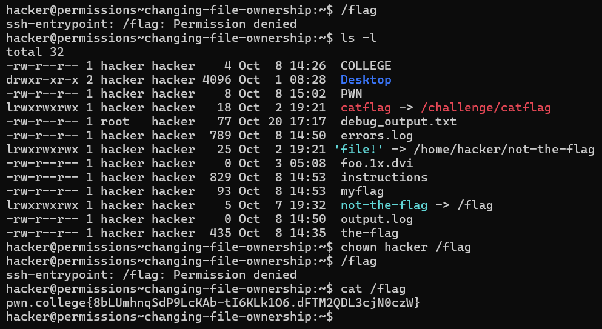
# Groups and Files

- **Objective**: Change the group ownership of the `/flag` file to the `hacker` group and read the flag.
- First, **change the group ownership** of the `/flag` file using the `chgrp` command:
  - `chgrp hacker /flag`
- Once the group ownership is changed, the `hacker` group will have access to the file.
- **Read the flag** by running:
  - `cat /flag`
  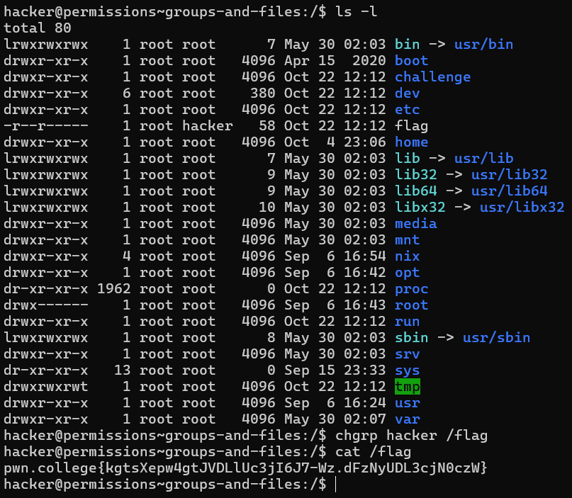
# Fun with Group Names

- **Objective**: Identify the current group name of the `hacker` user and change the group ownership of the `/flag` file accordingly.
- **Check your groups** by running:
  - `id`
- Look for the `groups` output to find the name of your group (it will be different from `hacker`).
- Use the `chgrp` command to change the group ownership of the `/flag` file:
  - `chgrp <your_group_name> /flag`
  - Replace `<your_group_name>` with the actual group name you found.
- **Read the flag** by running:
  - `cat /flag`
  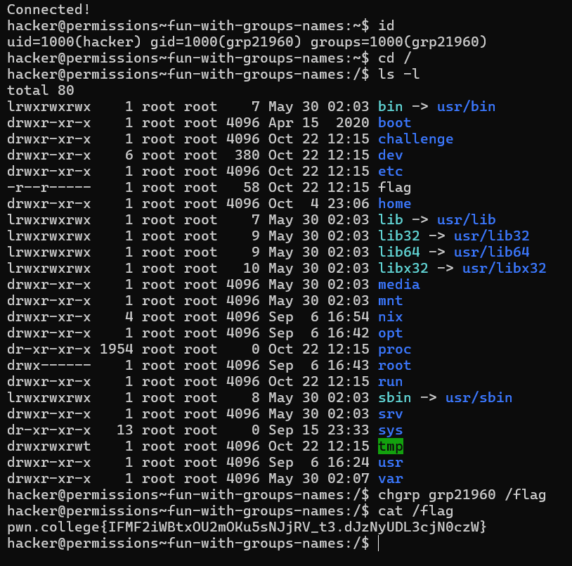
# Changing Permissions

- **Objective**: Modify the permissions of the `/flag` file to make it readable by your user.
- **Use the `chmod` command** to add read permissions for the group and others:
  - `chmod go+r /flag`
- This will allow the group and other users to read the `/flag` file.
- **Read the flag** by running:
  - `cat /flag`
  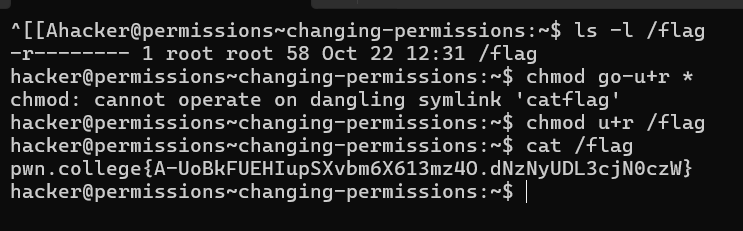
# Making Files Executable
 i dont know what wrong i did in the beginning of this level but this nearly brought a tear to my eye! even their LLM was saying i should contact the discord server for doing it. i had to thoroughly understand every function related to chmod and then i got through it. 
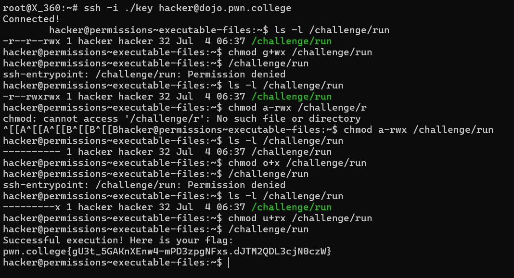
# Permission Tweaking Practice
LMAO was this easy after the last level debacle! needed a pen and paper to be very sure about what i was doing. to sum it up for my future self someday, g is global user, u is user, and o is others and + or - decide if were giving or denying access to the said user. and wrx descrive write read and executable process.
  - `chmod u+r /flag`
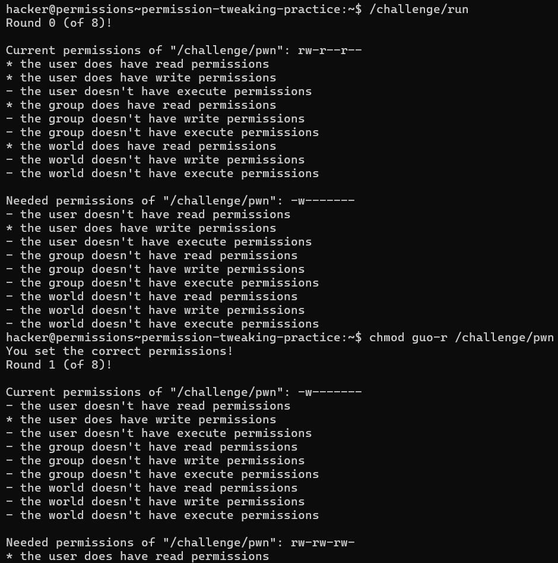
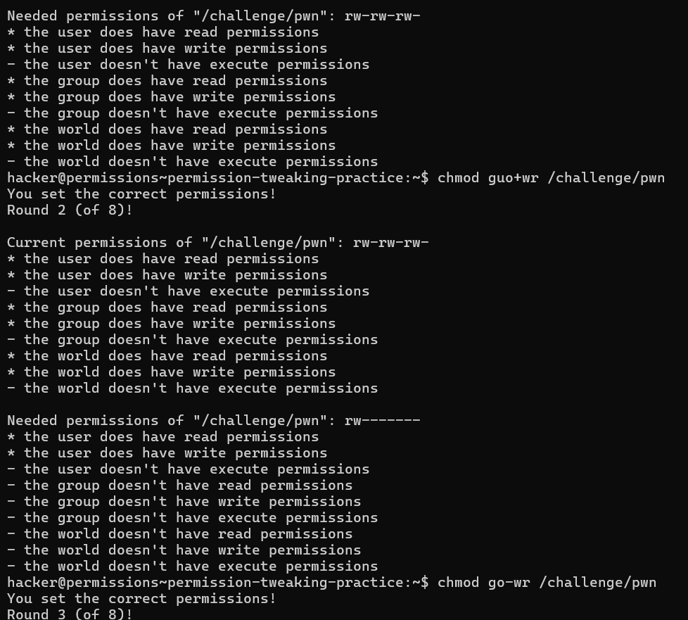
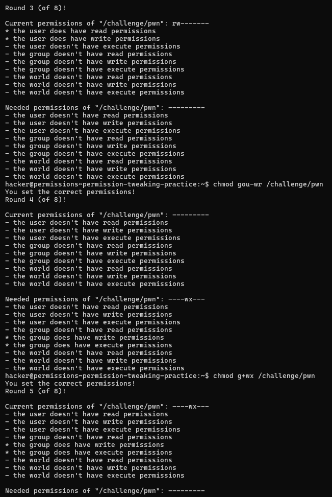
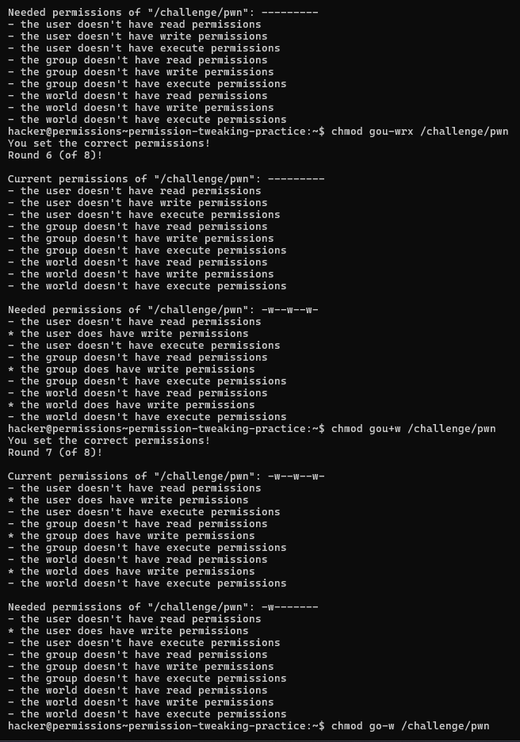
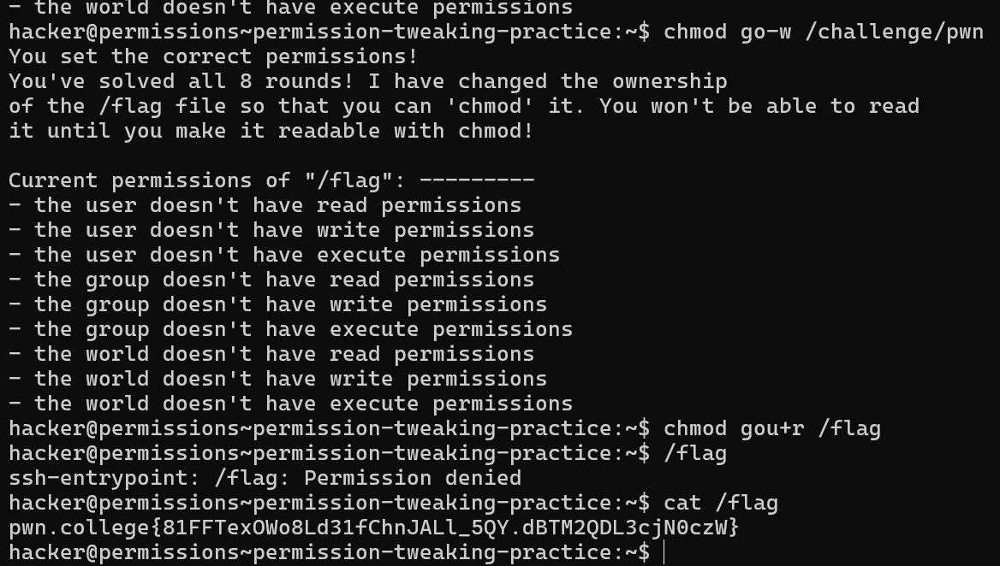
# Permission Setting Practice
- Change permissions of the `/challenge/pwn` file according to specific requests.
- Use the `=` operator to set permissions completely.
- Chain multiple permission settings using commas (`,`).
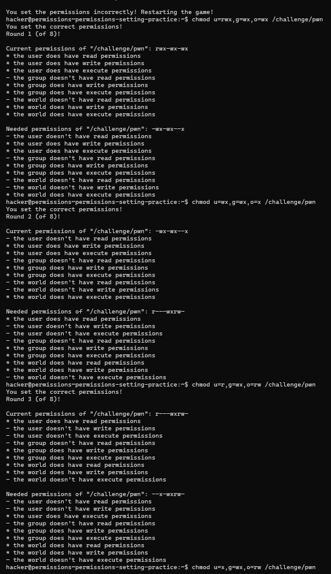
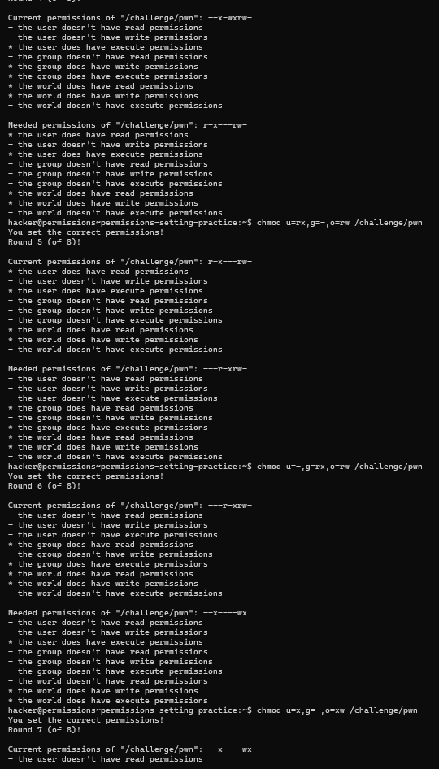
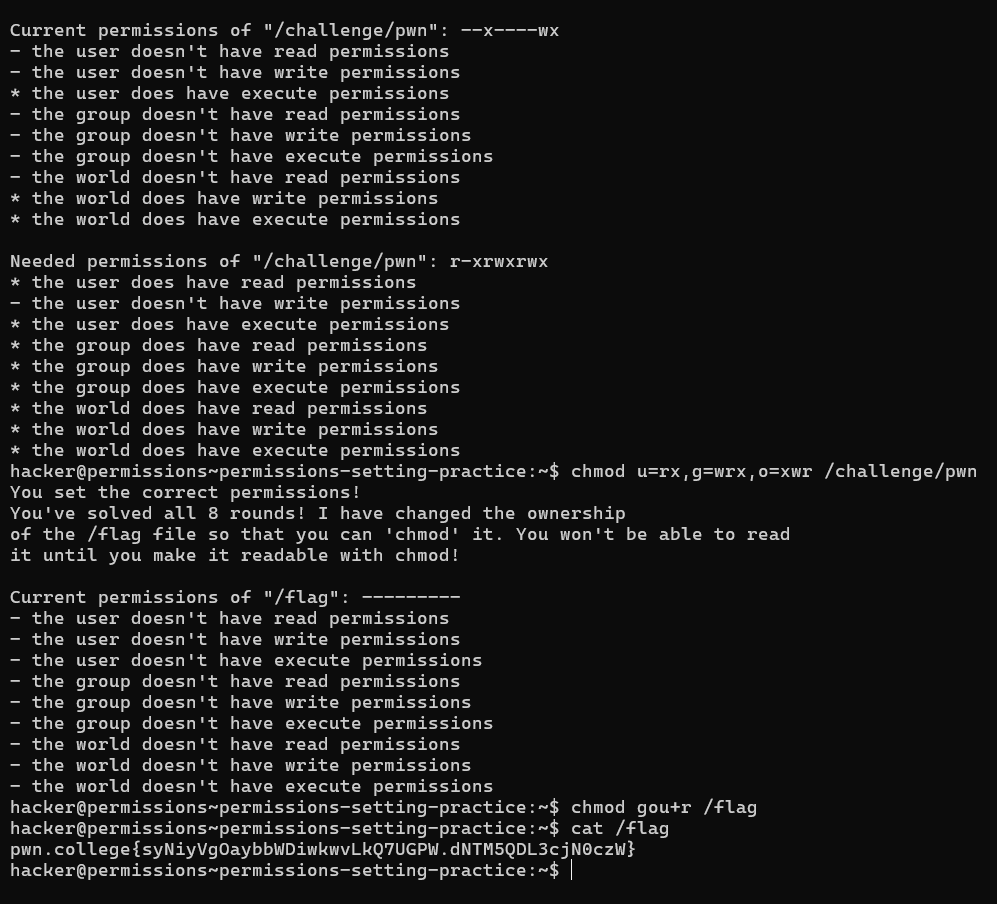

# The "Set User ID" (SUID) Bit
- **SUID Bit**: Allows a program to be executed with the permissions of its owner (usually root).
- **File Permissions with SUID**: When a file has the SUID bit set, it appears with an `s` in place of the executable bit (`x`).
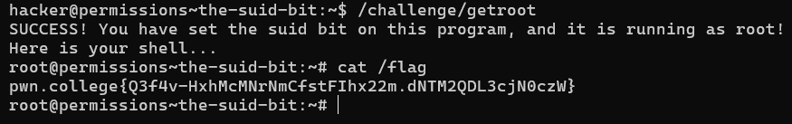