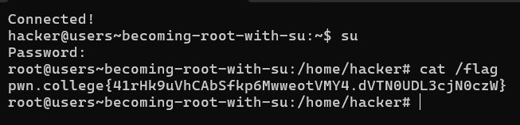
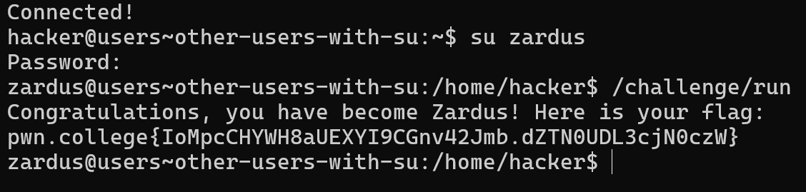
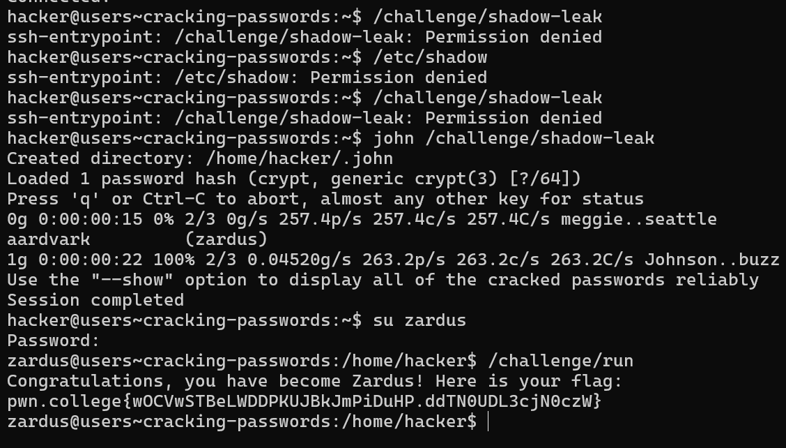
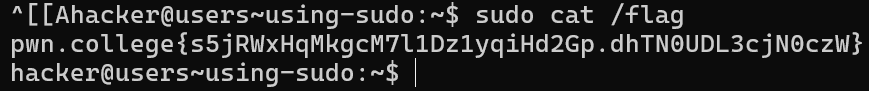

# Becoming Root with `su`

In this challenge, you need to become the root user using the `su` command.

#### Key Points:
- **Goal**: Elevate your privileges to root by using the `su` command, then read the flag.
- **Steps**:
  1. Run `su` to switch to the root user.
  2. Enter the root password: `hack-the-planet` when prompted.
  3. Once you become root, navigate to the flag file and read it.

This will grant you the necessary permissions to complete the task.


# Switching to Other Users with `su`

In this challenge, you need to switch to the `zardus` user using the `su` command and run a specific challenge file.

#### Key Points:
- **Goal**: Switch to the `zardus` user and execute `/challenge/run`.
- **Steps**:
  1. Use the `su` command to switch to the `zardus` user: 
     ```bash
     su zardus
     ```
  2. Enter the password: `dont-hack-me` when prompted.
  3. Once logged in as `zardus`, run the `/challenge/run` file.

This will allow you to complete the level as the `zardus` user.


# Cracking Passwords

In this challenge, you need to crack the password of the `zardus` user from a leaked `/etc/shadow` file and then switch to the `zardus` user to complete the task.

#### Key Points:
- **Goal**: Crack the leaked password of `zardus` from the `/challenge/shadow-leak` file, then switch to the `zardus` user and run `/challenge/run`.
- **Steps**:
  1. Use a password-cracking tool like John the Ripper to crack the password:
     ```bash
     john /challenge/shadow-leak
     ```
  2. Once the password is cracked, use `su zardus` and enter the cracked password.
  3. After switching to `zardus`, run `/challenge/run` to proceed.

This process simulates how a password can be cracked from a leaked shadow file.


# Using `sudo`

In this challenge, you need to use `sudo` to execute a command as root and read the flag.

#### Key Points:
- **Goal**: Use `sudo` to run a command with root privileges and access the flag.
- **Steps**:
  1. Run the necessary command with `sudo` to gain root privileges. For example:
     ```bash
     sudo cat /path/to/flag
     ```
  2. Enter your password if prompted.

This challenge highlights the simplicity and security of using `sudo` compared to `su` for administrative tasks.

